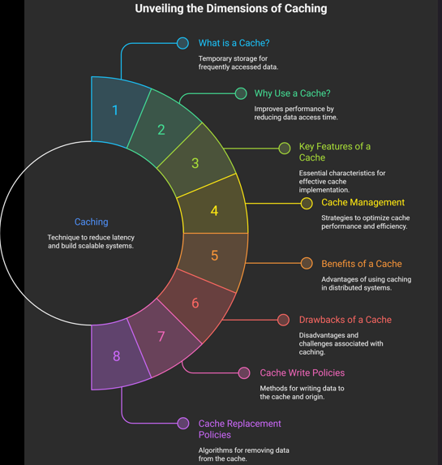

# Caching in Distributed Systems

Caching is an amazingly effective technique to reduce latency and is essential for building scalable, distributed systems. By storing frequently accessed data in temporary storage, systems can avoid repeated expensive computations and network calls.

---

## What is a Cache?

A cache is a high-speed data storage layer that stores a subset of data, typically transient in nature. Its primary goal is to ensure that future requests for that data are served faster than is possible by accessing the data’s primary storage location.

### Why Cache Management Matters
In a distributed environment, cache management is critical because it directly influences:
* **Cache Hit Ratios:** The percentage of requests served successfully from the cache.
* **Performance:** Higher hit ratios generally lead to lower latency.
* **Consistency:** Managing the synchronization between the cache and the database (DB) across distributed nodes.

---

## Key Benefits & Drawbacks

### Benefits
1. **Saves Network Calls:** Reduces the need to travel across the network to fetch data, lowering latency.
2. **Avoids Repeated Computations:** Complex calculations that result in static output can be cached to save CPU cycles.
3. **Reduces DB Load:** By handling read traffic, the cache protects the primary database from being overwhelmed.

### Drawbacks
1. **Expensive to Host:** Memory (RAM) is generally more expensive per gigabyte than disk storage.
2. **Potential Thrashing:** If the cache is too small or the policy is poor, data may be added and removed constantly, wasting resources.
3. **Eventual Consistency:** Keeping the cache perfectly synced with the database is difficult; users may occasionally see stale data.

---

## Cache Write Policies

The strategy used to write data to the cache and the database determines data consistency and system performance.

| Policy | Description | Pros | Cons |
| :--- | :--- | :--- | :--- |
| **Write-through** | Data is written to the cache and the DB **simultaneously**. | High data consistency. | Higher write latency (two writes). |
| **Write-back** | Data is written to the cache first; DB write happens **asynchronously**. | Extremely fast write performance. | Risk of data loss if cache fails before DB sync. |
| **Write-around** | Data is written directly to the DB, bypassing the cache. | Reduces cache flooding. | Initial read results in a cache miss. |

---

## Cache Replacement Policies

When the cache is full, the system must decide which old data to evict to make room for new entries.

### 1. LRU (Least Recently Used)
* **Mechanism:** Discards the items that haven't been used for the longest time.
* **Best For:** Scenarios where recently accessed data is likely to be accessed again soon (temporal locality).

### 2. LFU (Least Frequently Used)
* **Mechanism:** Counts how often an item is needed. Items with the lowest usage count are discarded first.
* **Best For:** Scenarios where certain data is historically much more popular than others, regardless of recent access.

### 3. Segmented LRU (SLRU)
* **Mechanism:** Divides the cache into a "probationary" segment and a "protected" segment.
* **Best For:** preventing one-time scans from flushing out useful cached items, thereby improving hit rates.

---

