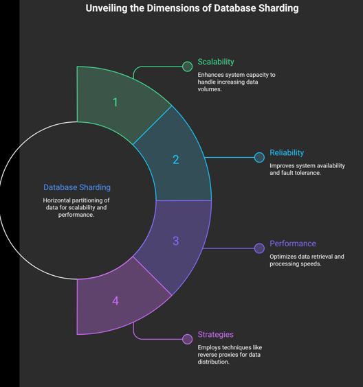

# Database Sharding: Key Concepts

## What is Sharding?
* **Definition:** Sharding is a method used to split a single large database into smaller, more manageable parts.
* **Technical Term:** This process is technically known as **horizontal partitioning**. Instead of storing all data in one place, it is spread across multiple servers.

## Why Use It?
* **Scalability:** It helps server-side systems grow easily by adding more servers rather than upgrading a single massive server.
* **Performance:** Queries run faster because they search through smaller chunks of data rather than the whole dataset.
* **Reliability:** If one shard (partition) fails, the others can usually keep running, preventing a total system crash.

## How It Works (The Shard Key)
* The system uses a specific piece of data called a **Shard Key** (like a User ID or Region) to decide where to store a new entry.
* This key acts like a distinct address, ensuring the system knows exactly which database server to send the data to.

## Implementation Strategy
* **Reverse Proxies:** These are often used as intermediaries. They look at the request and route it to the correct shard based on the logic defined by the shard key.

## Relevance
* Sharding is a critical topic in **system design interviews**. It is frequently the standard answer for making databases more available and high-performing under heavy loads.

---

