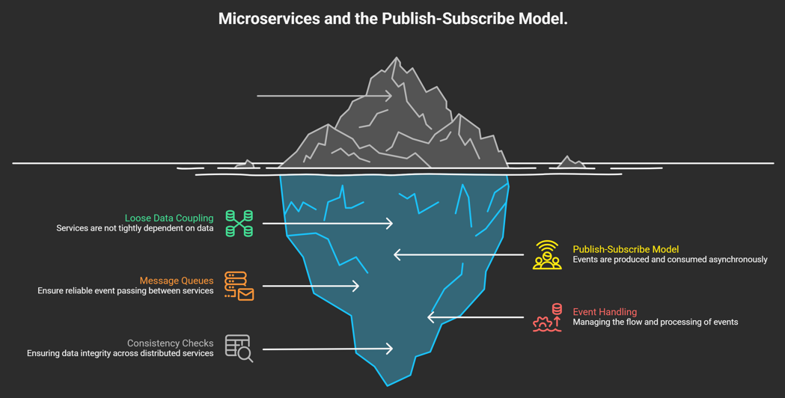

# Microservices Architecture: Pub-Sub Pattern

In a microservices ecosystem, the **Publish-Subscribe (Pub-Sub)** model is a key strategy for achieving loose data coupling and high system resilience.

---

## Architectural Overview
Unlike the traditional Request-Response model, Pub-Sub relies on an asynchronous event-driven flow:

1.  **Publishers:** Services that emit events (state changes) to a central broker.
2.  **Message Broker:** Middleware (e.g., **RabbitMQ**, **Apache Kafka**) that manages event distribution.
3.  **Subscribers:** Downstream services that consume events and perform specific actions.

## Pub-Sub vs. Request-Response

| Feature | Request-Response (REST/gRPC) | Publish-Subscribe (Event-Driven) |
| :--- | :--- | :--- |
| **Coupling** | **Tight**: Direct dependency between services. | **Loose**: Services are independent of each other. |
| **Execution** | **Synchronous**: Blocks until a response is received. | **Asynchronous**: Non-blocking; fire-and-forget. |
| **Reliability** | Fails if the receiving service is offline. | Message queues store events until services recover. |
| **Consistency** | **Strong**: Transactions are immediate. | **Eventual**: Data syncs across services over time. |

## Implementation Details

### Message Brokers
This architecture relies on robust message queuing systems to ensure reliable event passing:
* **RabbitMQ:** Excellent for complex routing and low-latency messaging.
* **Apache Kafka:** Optimized for high-throughput, log-based event streaming and replayability.

### Consistency Trade-offs
The Pub-Sub model is best used when **Strong Consistency** is not a strict requirement for every transaction. 
* **Eventual Consistency:** Services will eventually reach the same state, but there may be a slight delay.
* **Idempotency:** Downstream services must be designed to handle the same event multiple times without side effects.

> [!IMPORTANT]
> Designing for Pub-Sub requires careful event schema management and robust error-handling (Dead Letter Queues) to manage failed event processing.

---

