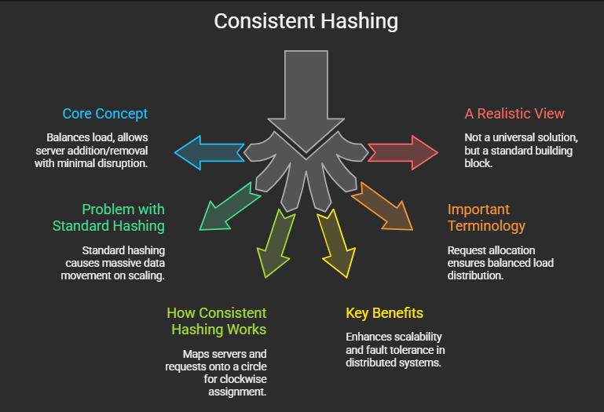

# LOAD BALANCING 

>### 1. The Core Concept
>**What is it?** Consistent Hashing is a technique used in distributed systems to distribute data (or requests) across a cluster of servers.
**The Goal:** It balances the load efficiently while allowing you to add or remove servers with minimal disruption.


>### 2. The Problem with Standard Hashing
>**Standard Approach:** Typically, systems map requests using a formula like hash(key) % number_of_servers.
>**The Flaw:** If you add or remove a server (changing the number_of_servers), the mapping for almost all keys changes.
**Result:** This causes massive data movement and cache misses, making the system unstable during scaling.


>### 3. How Consistent Hashing Works
>**The Ring:** Imagine a circle (the hash space). Both the Servers and the Requests (keys) are mapped onto this same circle using a hash function.
**Clockwise Assignment:** To determine which server handles a request, you map the request to the circle and move clockwise until you find the first server.
**Data Storage:** That server becomes responsible for processing that request or storing that data.


>### 4. Key Benefits
>Consistent hashing directly addresses two major system design principles:
>**Scalability**: When you add a new server to the ring, it only takes a portion of the load from its immediate neighbor. The rest of the ring remains unaffected.
>**Fault Tolerance:** If a server crashes (leaves the ring), its load is simply passed clockwise to the next available server. The system heals itself without a total reset.


>### 5. Important Terminology
>**Request Allocation:** The specific process of assigning a user request to a server. Consistent hashing ensures this assignment results in a balanced load distribution (close to equal).
>**Load Factor:** The amount of work or data assigned to a specific machine. Consistent hashing helps maintain a "good" load factor, preventing any single machine from being overwhelmed.


>### 6. A Realistic View
>Not a Silver Bullet: While powerful, Consistent Hashing is not a magic fix for all architecture problems. It is specifically a tool for request allocation and minimizing data movement.
**Subjectivity**: Server architecture is complex. There are outliers and edge cases where other strategies might be needed, but consistent hashing remains a standard "building block" for architects.


<div style="display: flex; flex-wrap: wrap; gap: 10px; align-items: flex-start;">



<div/>

```python
import hashlib
import bisect

class ConsistentHashing:
    def __init__(self, servers, num_replicas=3):
        self.num_replicas = num_replicas  # Virtual nodes for load balancing
        self.ring = {}  # Hash ring
        self.sorted_keys = []  # Sorted positions of servers
        self.servers = set()

        for server in servers:
            self.add_server(server)

    def _hash(self, key):
        """Hash function using MD5 (returns an integer)."""
        return int(hashlib.md5(key.encode()).hexdigest(), 16)

    def add_server(self, server):
        """Add a server and its replicas to the hash ring."""
        self.servers.add(server)
        for i in range(self.num_replicas):
            hash_val = self._hash(f"{server}-{i}")
            self.ring[hash_val] = server
            bisect.insort(self.sorted_keys, hash_val)

    def remove_server(self, server):
        """Remove a server and its replicas from the hash ring."""
        if server in self.servers:
            self.servers.remove(server)
            for i in range(self.num_replicas):
                hash_val = self._hash(f"{server}-{i}")
                self.ring.pop(hash_val, None)
                self.sorted_keys.remove(hash_val)

    def get_server(self, key):
        """Find the closest server for the given key."""
        if not self.ring:
            return None
        hash_val = self._hash(key)
        index = bisect.bisect(self.sorted_keys, hash_val) % len(self.sorted_keys)
        return self.ring[self.sorted_keys[index]]

# Initialize with servers
servers = ["S0", "S1", "S2", "S3", "S4", "S5"]
ch = ConsistentHashing(servers)
```