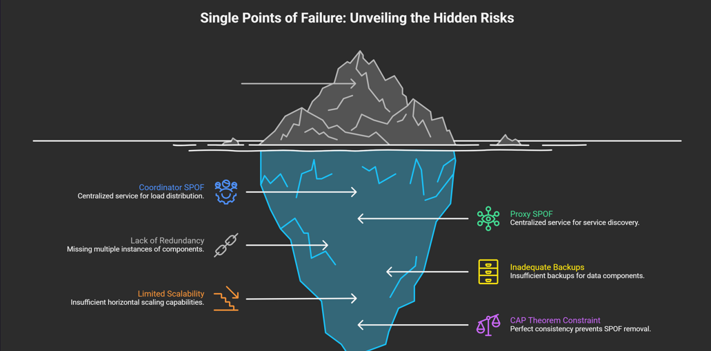

# Single Point of Failure (SPOF)

A **Single Point of Failure (SPOF)** is a specific component in a computing system that, if it fails, causes the entire system to stop working. Because of this high risk, engineers invest significant time and resources into identifying and removing these points during the architecture and design phases.

## Common Sources of SPOF
SPOFs frequently appear in centralized services that manage other parts of the system.

* **Coordinators & Proxies:** These components are responsible for distributing traffic (load balancing) and tracking active services (service discovery).
* **The Risk:** Because they handle critical, centralized tasks, if they go down, the components they manage become inaccessible or uncoordinated.

## Mitigation Strategies
To make a system more resilient, you can use the following strategies to eliminate SPOFs:

### 1. Redundancy (Multiple Instances)
Instead of relying on a single instance of a component, run multiple copies simultaneously.
* **How it works:** If one instance fails, the system’s dependency graph is flexible enough to automatically switch traffic to a healthy instance.
* **Benefit:** Prevents request failure and maintains uptime.

### 2. Backups and Failover
This approach is particularly useful for stateful components that handle data, such as databases.
* **How it works:** Maintain a backup copy of the component. If the primary fails, the system performs a "quick switch" (failover) to the backup.
* **Benefit:** Preserves data integrity and availability.

### 3. Scaling and Distribution
Broader architectural patterns help reduce the impact of any single failure:
* **Resource Allocation:** Ensuring critical components have sufficient resources to handle load spikes.
* **Horizontal Scaling:** Adding more machines to the pool rather than just making one machine stronger.
* **Replication & Partitioning:** Distributing data across multiple locations so that the loss of one partition doesn't mean the loss of all data.

---

> **A Note on the CAP Theorem**
> It is important to remember that you cannot always perfectly eliminate SPOFs if your system requires **perfect consistency**.
>
> According to the **CAP Theorem** (Consistency, Availability, Partition Tolerance), in the event of a network failure, you often have to choose between keeping data perfectly consistent or keeping the system available. This trade-off can limit how effectively you can remove SPOFs in strictly consistent systems.

---

